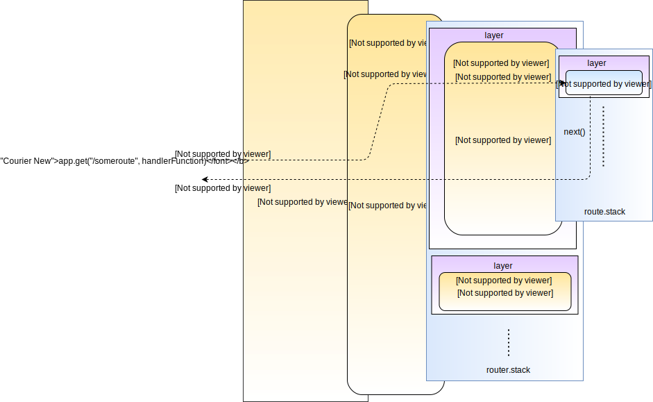
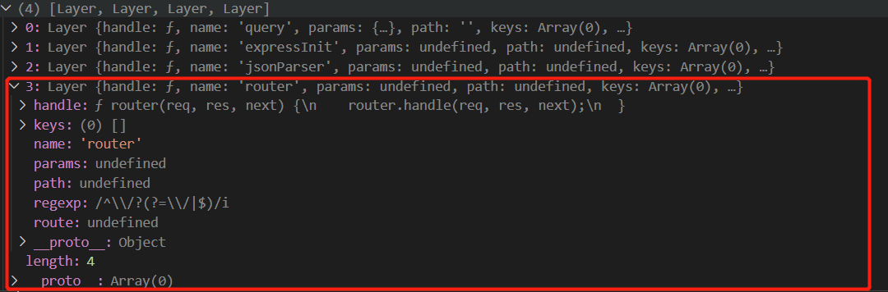

本文通过源码去分析express框架是如何工作的。

先了解下express框架结构,如下图所示：


图片引用自: [how-expressjs-works](https://www.sohamkamani.com/blog/2018/05/30/understanding-how-expressjs-works/)
(英文水平好的也可以看下这篇文章，这里我们记录下自己的分析)

同时,[官方API文档](https://expressjs.com/en/4x/api.html#express)


## 1.import 阶段


```node
// index.mjs
import express from 'express'
```
方法的声明我们直接略过，这里直接看看哪些代码会被执行
程序最终加载的是这个文件
```node

//     ···lib/express.js···

var proto = require('./application');
var Route = require('./router/route');
var Router = require('./router');
exports = module.exports = createApplication;

function createApplication() {
    //······
}

//移除对过期中间件的支持,当尝试在导入express的模块中调用express.bodyParser()的时候会抛出异常
var removedMiddlewares = [
    'bodyParser',
    //······
]
removedMiddlewares.forEach(function (name) {
  Object.defineProperty(exports, name, {
    get: function () {
      throw new Error('Most middleware (like ' + name + ') is no longer bundled with Express and must be installed separately. Please see https://github.com/senchalabs/connect#middleware.');
    },
    configurable: true
  });
});

```


下面分别在看看上面比较重要的三个模块
```node
var proto = require('./application');//aplication
var Route = require('./router/route');//router
var Router = require('./router');//route
```
application(lib/application.js)
```node
var Router = require('./router');
var methods = require('methods');
var app = exports = module.exports = {};
//这里循环定义了methods里面的方法 也就是我们经常使用的app.get,app.post这一类方法;
methods.forEach(function(method){
  //······
  };
});

```
Router(lib/router/index.js)
```node
var Route = require('./route');
var Layer = require('./layer');

//跟application下相似,用于当我们拆分成路由时候的router.get() ,router.post();
methods.concat('all').forEach(function(method){
  //······
  };
});
```
Route(lib/router/route.js)
```node
var Layer = require('./layer');
module.exports = Route;
function Route(path) {
  //······
}
methods.forEach(function(method){
  //······
});
```
可以看到在import阶段，上面三个模块都有 <code>methods.forEach(...)</code> ，都定义了我们经常会用到的方法 像app.get(),app.post()或是 拆分成路由的 router.get(),router.post()等等。这里先简单说下三个methods.forEach内容以及关联,以app.get(path,fn)为例:

> application.get()会初始化一个router并调用该router.route(),传入当前path。
router.route会生成一个新的route,并且生成一个新的layer,该layer绑定该route.dispatch方法,然后将该layer入栈(router.stack),然后返回该route。
最后会调用返回的route的get方法,并传入fn。route.get方法会为我们传入的fn生成一个新的layer并将该layer入route.stack栈，注意区分router和route，下面也会在进一步分析。


## 2. 创建一个新的app实例
```node
  const app = express();
```

这里会调用到express.js里面的createApplication方法，如下所示。
mixin是merge-descriptor模块里的merge方法 <code>merge-descriptors - merge(dest, src, redefine)</code> ,作用是将原始对象<code>src</code>的属性和描述符<code>descriptor</code>合并到目标对象<code>dest</code>，这里将proto(application.js)的属性和描述符合并到app上，然后调用了app.init()进行初始化;
返回后的app有了application下的所有属性和方法。
```node
function createApplication() {
  var app = function(req, res, next) {
    app.handle(req, res, next);
  };
  //····
  mixin(app, proto, false);
  //····
  app.init();
  return app;
}

```


## 3. 创建简单的路由
```node
// ···index.mjs···
app.get('/get',(req,res,next)=>{
  res.end('hello');
})
```
代码最终是调用到application.js下面的app[method],这里method是get.
我们简化称上面代码的两个参数路径为path，自定义的回调函数为fn.
从下面代码可以看到先实例化出一个router，然后调用了lib/route/index.js下的proto.route方法将当前path传入，
得到一个route，然后调用该route的get方法并将fn传入


```node
//···application.js···
methods.forEach(function(method){
  app[method] = function(path){
    //这里并不会进入 因为我们这里get方法提供了两个参数
    if (method === 'get' && arguments.length === 1) {
      // app.get(setting)
      return this.set(path);
    }
    this.lazyrouter();
    //···lib/route/index.js - proto.route ···
    var route = this._router.route(path);

    //···lib/route/route.js ···,这里传入的是我们自定义的callback，也就是返回hello字符,并且这里可以传入多个，比如有中间件的情形
    route[method].apply(route, slice.call(arguments, 1));
    return this;
  };
});

app.lazyrouter = function lazyrouter() {
  //如果this._router不存在 则初始化一个router
  if (!this._router) {
    this._router = new Router({
      caseSensitive: this.enabled('case sensitive routing'),
      strict: this.enabled('strict routing')
    });
    //······
  }
};

```
proto.route方法生成了一个新的route和layer,并且该layer绑定的是方法是route.dispatch方法,然后将该layer加入stack里面，lib/route/index.js下面的stack存放的layer里面绑定的是route.dispatch方法，
```node

//···lib/route/index.js···
proto.route = function route(path) {
  //根据path生成新的route
  var route = new Route(path);

  //当前这个layer是在 router下的 ，第三个参数传的是route下面的dispatch方法
  var layer = new Layer(path, {
    sensitive: this.caseSensitive,
    strict: this.strict,
    end: true
  }, route.dispatch.bind(route));

  //保存当前route进layer
  layer.route = route;
  //layer stack
  this.stack.push(layer);
  return route;
};
```

lib/route/route.js下route.get，通过代码也是可以看出为我们提供的fn(如果有多个，则循环)创建一个新的layer并将layer 入当前模块的stack栈
```node
//···lib/route/route.js ···
//这里我们的method是get,并且只有一个回调函数fn
methods.forEach(function(method){
  Route.prototype[method] = function(){
    var handles = flatten(slice.call(arguments));
    for (var i = 0; i < handles.length; i++) {
      var handle = handles[i];
      //······

      //为每个handle都按顺序生成layer并且push进stack，这里的stack和lib/route/index.js里面的stack不是同一个,看一开始的结构图就能看到
      var layer = Layer('/', {}, handle);
      layer.method = method;

      this.methods[method] = true;
      this.stack.push(layer);
    }

    return this;
  };
});
```
从上面分析我们可以看到lib/route/index.js下有个layer stack，里面的layer绑定的是不同path生成的route的dispatch方法，并且每个layer下面有当前的route属性,这个route本身又有个layer stack，里面存的是一开始我们自己的回调方法fn(也就是输出hello字符)，并且如果有中间件的话，也会为这个中间件生成一个layer。
准备工作基本完成,我们下面看看从网页访问对应路由之后程序是如何最终调用到我们的回调函数fn


## 4. 启动监听并访问get路由
```node
app.listen(4399,(err)=>{
    if(err){
        throw err
    }
    console.log("server started successfully")
})
```
浏览器直接 http://localhost:4399/get 即可。
开始会进入application.js下面的createApplication下面的app方法，并且把http的request和response对象传入,然后调用app.handle。
app.handle会直接调用router.handle
```node
// ···application.js···
function createApplication() {
  var app = function(req, res, next) {
    app.handle(req, res, next);
  };
  //······
  return app;
}


app.handle = function handle(req, res, callback) {
  var router = this._router;

  // final handler
  var done = callback || finalhandler(req, res, {
    env: this.get('env'),
    onerror: logerror.bind(this)
  });

  // no routes
  if (!router) {
    debug('no routes defined on app');
    done();
    return;
  }

  router.handle(req, res, done);
};

```
router.handle方法篇幅太长,只粘贴了里面的next方法
router.handle里面最主要的就是next方法,逻辑是取出stack里面符合当前path的layer,然后调用layer.handle_request方法。
layer.handle_request最后是调用layer.handle,注意这一层的layer,也就是router的layer绑定的是route的dispatch方法。
那么layer.handle就是lib/route/route.js的dispatch方法,dispatch里面也有个stack和next方法。
和lib/route/index.js类似，但是dispatch里面的stack里面的layer才存在我们自定义的fn

```node
// ···lib/route/index.js ··· 
function next(err) {
    //······
    var layer;
    var match;
    var route;
    //match代表我们request的路径是否和我们layer里面的路径相符，相符的时候找到对应路由并退出循环
    while (match !== true && idx < stack.length) {
      layer = stack[idx++];
      match = matchLayer(layer, path);
      route = layer.route;
      //······
    }
    //······ 
    //没有错误的情况下最终是调用layer.handle_request
    self.process_params(layer, paramcalled, req, res, function (err) {
     //······ 
      if (route) {
        return layer.handle_request(req, res, next);
      }
      trim_prefix(layer, layerError, layerPath, path);
    });
  }


```


下面代码会从stack取出layer执行layer.handle_request，如果当前是我们的get layer 则会执行我们的返回hello字符的方法给前端。
```node
// ···lib/route/route.js ···
Route.prototype.dispatch = function dispatch(req, res, done) {
  var idx = 0;
  var stack = this.stack;
  var method = req.method.toLowerCase();
  req.route = this;
  next();
  function next(err) {
    var layer = stack[idx++];
    if (!layer) {
      return done(err);
    }
    if (layer.method && layer.method !== method) {
      return next(err);
    }

    if (err) {
      layer.handle_error(err, req, res, next);
    } else {
      layer.handle_request(req, res, next);
    }
  }
};
```

至此一次请求就完成了。
附上另一张图,引用自: [how-expressjs-works](https://www.sohamkamani.com/blog/2018/05/30/understanding-how-expressjs-works/)



## 5.小结
我们省略了很多判断，只关注比较核心的逻辑。
express通过两个stack结合layer的形式去处理我们日常的请求,核心就是给每个方法生成一个layer，然后通过两个next()方法去控制整体流程。
从上面也可以看到，我们可以建立很多个route,像app.get('path1'),app.get('path2')。
而上图最右侧的layer也告诉我们可以有很多回调方法,像app.get('path',fn1,fn2),这也是中间件的实现形式。
例如fn1是我们的登录校验方法，fn2是我们的数据，那我们就可以通过fn1里面是否调用next()来控制fn2是否被执行等等。


## 6.其他
分析下express常用到的其他方法以及后面看下一些中间件的源码

### 6.1 app.use和拆分成模块的router

#### app.use
我们分别拿bodyparser和拆分成模块的router做实验,注意当前版本的express已经把bodyparser整合进lib/express.js里面,所以无需再专门导入bodyparser

##### <code>app.use(express.json())</code>
bodyparser的作用是按照不同格式去解析req中body的内容，然后将解析后的body附加到req上面,那么我们就可以直接通过req.body获取body,同时注意express.json()返回的是一个方法，并且该返回的方法的签名是fn(req,res,next)，是不是很熟悉，先不做深究，这里主要关注app.use的逻辑

appilcation.js
可以看到先初始化router，然后将我们提供的fn(express.json())传入router.use
```node
app.use = function use(fn) {
  var offset = 0;
  var path = '/';

  //获取路径 ······

  var fns = flatten(slice.call(arguments, offset));

  //初始化router
  this.lazyrouter();
  var router = this._router;
  fns.forEach(function (fn) {
    // non-express app
    if (!fn || !fn.handle || !fn.set) {
      return router.use(path, fn);
    }
    //下面是用于多个app实例的时候的情况，暂不做讨论,本案例不会进到这里，会在上面进入到router.use
    //const app = express(), app1 = express(), app.use(app1); 
    fn.mountpath = path;
    fn.parent = this;
    router.use(path, function mounted_app(req, res, next) {
      var orig = req.app;
      fn.handle(req, res, function (err) {
        setPrototypeOf(req, orig.request)
        setPrototypeOf(res, orig.response)
        next(err);
      });
    });
    fn.emit('mount', this);
  }, this);
  return this;
};
```
lib/router/index.js
通过下面看到,该方法为我们提供的中间件方法生成一个新的layer并且入栈，这里默认的path是"/",到这里基本上准备工作就完成了,
我们通过app.use(express.jso()),在router(lib/router/index.js)的stack里面加了一层我们的中间件的layer,并且路径是"/"当我们访问 "/*"时,该中间件会匹配到，并且会调用express.json()返回的方法
```node
proto.use = function use(fn) {
  var offset = 0;
  var path = '/';

  //获取路径 ······

  var callbacks = flatten(slice.call(arguments, offset));
  for (var i = 0; i < callbacks.length; i++) {
    var fn = callbacks[i];
    //为该中间件生成一个新的layer,fn即为我们的express.json();
    var layer = new Layer(path, {
      sensitive: this.caseSensitive,
      strict: false,
      end: false
    }, fn);
    //因为是中间件,所以没有route 和lib/router/index.js下面的methods.forEach不同
    layer.route = undefined;
    //入栈
    this.stack.push(layer);
  }

  return this;
};
```

访问http://ip:port/
流程和上面的get案例一样, app.handle-->router.handle-->next(),开始循环出栈，判断当前req的路径和我们的layer的路径是否相符。
最终会拿到我们的express.json()那个layer,调用该layer.handle_request,然后就到我们的bodyparser.jsonParser里面。
这里简单贴下方法，最后就会把解析后的body添加到req里面，可以通过req.body访问到。
```node
function jsonParser (req, res, next) {
   
    // ······
  
    // read
    read(req, res, next, parse, debug, {
      encoding: charset,
      inflate: inflate,
      limit: limit,
      verify: verify
    })
  }
```
附上一张图:

可以看到app.use最后是用到router.use，最终也是通过生成新的layer的形式去控制。
万物皆围绕layer。


#### 使用拆分的router的形式
我们经常我把router拆分成单独的模块，然后在程序中导入并通过app.use(router)的形式去利用
例如:我们有这么一个userRouter.js
```node
import express from "express"
const router = new express.Router()

router.get('/route',(req,res)=>{
    res.end(JSON.stringify({message:"hello"}))
})

export default router;
```
然后在程序中使用这个router
```node
import express from 'express'
import router from 'userRouter.mjs'
const app = express();
app.use("/user",router);
app.listen(4399,(err)=>{
    if(err){
        throw err
    }
    console.log("server started successfully")
})
```
app.use->router.use我们不再赘述,先附上一张debug时候的图:
可以看到我们在`new express.Router()`的时候返回给我们的是下面这个方法

```node
var proto = module.exports = function(options) {
  var opts = options || {};

  function router(req, res, next) {
    router.handle(req, res, next);
  }

  // mixin Router class functions
  setPrototypeOf(router, proto)
  
  //······
  
  router.stack = [];

  return router;
};
```
是不是又很熟悉，一样的方法签名fn(req,res,next),我们也可以定义这样的方法去实现自己的中间件。


所以拆分成的router本身 也是调用 app.use -> lib/router/index.js下面proto.use 生成新的layer，绑定上面的签名方法。


这里要说明一下，application下面有个lazyrouter方法,作用是初始化一个router并且绑定到app下面，下图的app._router就是这个方法生成的。
```node
app.lazyrouter = function lazyrouter() {
  if (!this._router) {
    this._router = new Router({
      caseSensitive: this.enabled('case sensitive routing'),
      strict: this.enabled('strict routing')
    });

    this._router.use(query(this.get('query parser fn')));
    this._router.use(middleware.init(this));
  }
};
```
但是我们自定义的router最终是变成了layer的形式，存在下图第一个layer层级，也就是router.stack里面
[](https://www.sohamkamani.com/blog/2018/05/30/understanding-how-expressjs-works/)


当我们再去访问 /user/route的时候，会匹配上我们这个装有router的layer,调用layer.handle_request,最后会调用router()
```node
 function router(req, res, next) {
    router.handle(req, res, next);
  }
```
又回到router.handle，只不过该router不再是app._router,而是我们自定义router,开始我们在自定义的router里面也写了个router.get。
```node
router.get('/route',(req,res)=>{
    res.end(JSON.stringify({message:"hello"}))
})
```
拿router.get来说，我们自定义的router也存在上图两个层级的layer。
又变成像一开始说的那样，第一层layer绑定的是route.dispatch方法,第二层绑定的是我们自己回调函数,通过next()去控制流程。


万物皆layer，layer yyds。


### 6.2 相同路由时，next()方法的测试 
我们通过配置相同的两个路由看看next方法在express中的流程控制
```node
/**
 * 测试相同路由 调用和不调用next的情况
 */

//调用next():注意第一层用了res.wirte,如果调用res.send或res.end会关闭当前res流,则调用next到第二层会报错
app.get('/',(req,res,next)=>{
   res.write("first");
   next();
})
app.get('/',(req,res)=>{
    res.end("second");
 })

//输出: firstsecond


//不调用next()
app.get('/',(req,res,next)=>{
   res.end("first");
})
app.get('/',(req,res)=>{
    res.end("second");
 })

//输出: first
```
##### 分析
我们直接看系统监听之后我们的router.stack里面的layer情况

上图中第三第四个就是我们自定义的两个get。

router里面的next(),再次说到这一层我们的两个路由的layer绑定的是route.dispatch方法。
```node
function next(err) {

    //······
    
    // 找到下一个匹配的layer
    var layer;
    var match;
    var route;

    while (match !== true && idx < stack.length) {
      layer = stack[idx++];
      match = matchLayer(layer, path);
      route = layer.route;
    }

    //······

    self.process_params(layer, paramcalled, req, res, function (err) {
      if (err) {
        return next(layerError || err);
      }

      if (route) {
        return layer.handle_request(req, res, next);
      }

      trim_prefix(layer, layerError, layerPath, path);
    });
  }
```

route.dispatch里面的next()
```node
Route.prototype.dispatch = function dispatch(req, res, done) {
  var idx = 0;
  var stack = this.stack;
  if (stack.length === 0) {
    return done();
  }

  var method = req.method.toLowerCase();
  if (method === 'head' && !this.methods['head']) {
    method = 'get';
  }

  req.route = this;

  next();

  function next(err) {
    // signal to exit route
    if (err && err === 'route') {
      return done();
    }

    // signal to exit router
    if (err && err === 'router') {
      return done(err)
    }

    var layer = stack[idx++];
    if (!layer) {
      return done(err);
    }

    if (layer.method && layer.method !== method) {
      return next(err);
    }

    if (err) {
      layer.handle_error(err, req, res, next);
    } else {
      //这里会执行我们自定义的callback,将next传入
      layer.handle_request(req, res, next);
    }
  }
};

```
注意上面的done方法，是router(lib/router/index.js)的next方法。
那么按照流程:
--> router下layer.handle_request(req,res,next)
--> route.dispatch() 
--> route下layer.handle_request(req,res,next)
--> 自定义的回调函数

- 第一个自定义的回调函数里面调用next():
  > 这时的next是route.js dispatch里面的next(),因为我们两个路由都只提供了一个回调函数，所以调用next进去之后<code>var layer = stack[idx++];</code>会得到一个undefined的layer,那么这时会执行<code>return done(err);</code>而这个done就是我们router里面的next(),又会推进到我们定义的第二个get的layer，然后dispatch，最后执行第二个get的回调函数

- 第一个自定义的回调函数里面不调用next():
  >第一个回调函数执行完之后,不再回到next，而会直接返回字符串"first"，最后结束掉整个流程。


###6.3 express的requset和response

##### 6.3.1 流(stream)

##### 6.3.2 EventEmitter
##### 6.3.3 io
### 6.4 编码
### 6.5 模板引擎
##### 6.5.1 ejs

### 6.6 restful风格

### 6.7 多个app实例的情况

##7.常用中间件
[Express middleware 官网](https://expressjs.com/en/resources/middleware.html)

#### 7.1 express自带的中间件
我们注意到6.2节分析下面的图最前面的两个layer，这两个layer是express自带的中间件。在lib/middleware下面 分别为query中间件和init中间件

这两个中间件是在app.lazyrouter下面加入的
```node
app.lazyrouter = function lazyrouter() {
  if (!this._router) {
    //······
    this._router.use(query(this.get('query parser fn')));
    this._router.use(middleware.init(this));
  }
};
```
##### query中间件 :
<code>this.get('query parser fn')</code>拿到的是<code>lib/utils.compileQueryParser</code>

初始化是在application.js ：
```node
this.set('query parser', 'extended');
app.set = function set(setting, val) {
  this.settings[setting] = val;
  //······
  switch (setting) {
     //······
    case 'query parser':
      this.set('query parser fn', compileQueryParser(val));
      break;
     //······
  }
  return this;
};
```
lib/utils :
我们上面初始化时传入的第二个参数为"extended",所以最终拿到的是<code>parseExtendedQueryString</code>,里面调用<code>qs.parse</code>。
qs源码不在粘贴，我们这里知道他的作用是将url问号后面参数形式的字符串解析成对象即可 例如 qs.parse('a=c') ==> { a: 'c' },那么继续往下。
```node
exports.compileQueryParser = function compileQueryParser(val) {
  var fn;
  //······
  switch (val) {
   //······
    case 'extended':
      fn = parseExtendedQueryString;
      break;
  //······
  }
  return fn;
}

function parseExtendedQueryString(str) {
  return qs.parse(str, {
    allowPrototypes: true
  });
}

```
对于<code>this._router.use(query(this.get('query parser fn')));</code>,我们已经知道<code>this.get('query parser fn')</code>返回的是parseExtendedQueryString,里面调用qs.parse,那么进入到query中间件的源码。

lib/middleware/query.js
可以看到最下面的签名方法，先是执行<code>parseUrl(req).query</code>,这里parseUrl的作用是
取到该次req的url属性，然后返回一个Url对象，里面有href,query,search属性。
例如:/get?a=1 ,href:/get?a=1,query:a=1,search:?a=1。
那么queryparse(val, opts);最后会解析出 {a:1}这样一个键值对,并且添加到req.query下面

```node
module.exports = function query(options) {
  var opts = merge({}, options)
  //默认的parse也是qs.parse,我们刚刚看到express用的是parseExtendedQueryString返回也是qs.parse
  var queryparse = qs.parse;

  //因为我们传入的是function,所以会进入该判断,替换掉默认的queryparse
  if (typeof options === 'function') {
    queryparse = options;
    opts = undefined;
  }
  //跳过
  if (opts !== undefined && opts.allowPrototypes === undefined) {
    // back-compat for qs module
    opts.allowPrototypes = true;
  }

  //这个方法最终是layer绑定的方法,请求进来时会调用
  return function query(req, res, next){
    if (!req.query) {
      var val = parseUrl(req).query;
      req.query = queryparse(val, opts);
    }
    next();
  };
};

```
该中间件的作用就是解析url后面的参数，将string变成对象，并添加到req.query中。


##### inti中间件
lib/middleware/init.js，基本上没有做太多操作，符合条件设置下header
将req绑到res,将res绑到req，互绑，req设置app.request的原型,res设置app.response的原型,
然后调用next往下一个layer移动。
```node
exports.init = function(app){
  return function expressInit(req, res, next){
    if (app.enabled('x-powered-by')) res.setHeader('X-Powered-By', 'Express');
    req.res = res;
    res.req = req;
    req.next = next;
    setPrototypeOf(req, app.request)
    setPrototypeOf(res, app.response)
    res.locals = res.locals || Object.create(null);
    next();
  };
};
```


